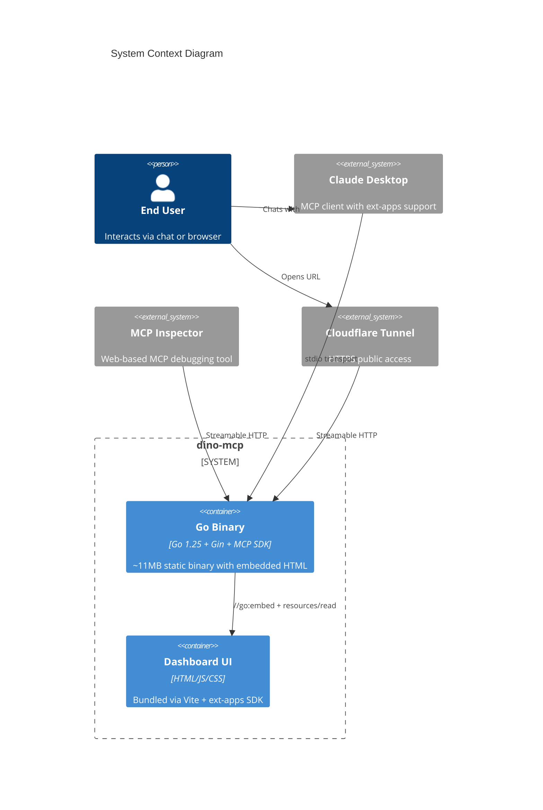
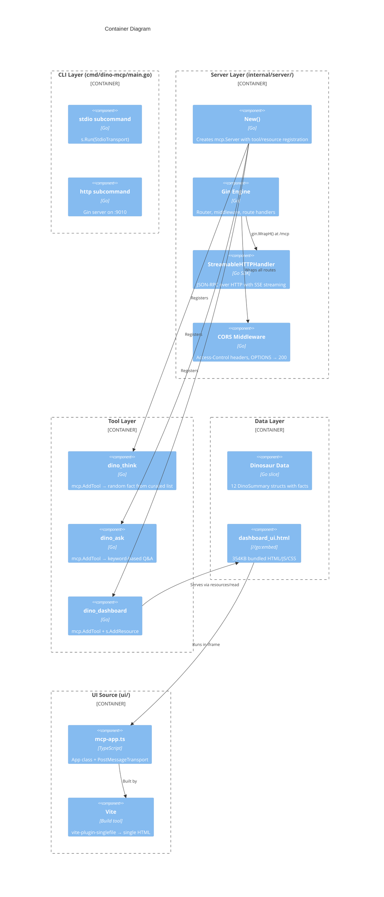
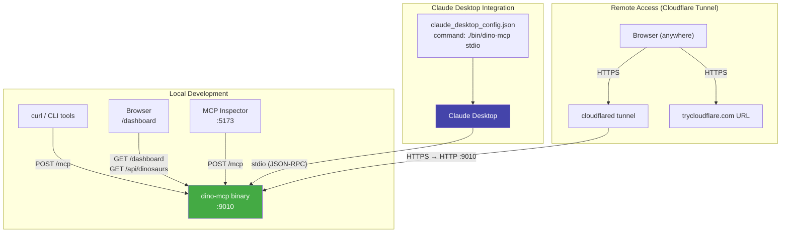
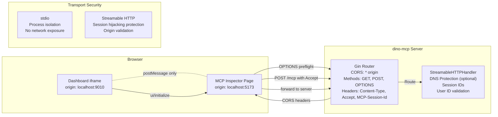

# Architecture — dino-mcp

> **System architecture, component relationships, and data flow.** For architects, senior engineers, and AI agents.

---

## System Context



---

## Container Architecture



---

## Request Lifecycle

```mermaid
sequenceDiagram
  participant U as User/Client
  participant C as CLI (main.go)
  participant G as Gin Router
  participant M as MCP Handler
  participant S as Server
  participant T as Tool/Resource
  
  Note over U,T: INITIALIZATION
  U->>C: dino-mcp http -addr :9010
  C->>G: New Gin engine
  C->>S: server.New() → register tools + resources
  S-->>C: Ready
  
  Note over U,T: FIRST REQUEST
  U->>G: POST /mcp (Content-Type: application/json)
  G->>G: CORS check (OPTIONS → 200 earlier)
  G->>M: gin.WrapH(handler)
  M->>M: Validate Accept header
  M->>M: Check DNS rebinding
  M->>S: Initialize protocol
  S-->>M: Session ID created
  M-->>G: HTTP 200 + Mcp-Session-Id
  G-->>U: Response with session
  
  Note over U,T: TOOL CALL
  U->>G: POST /mcp (tools/call dino_think)
  G->>M: Route /mcp
  M->>S: Execute tool
  S->>T: Call handler
  T-->>S: DinoThinkResult
  S-->>M: CallToolResult + structuredContent
  M-->>G: SSE or JSON response
  G-->>U: Result data
  
  Note over U,T: RESOURCE READ
  U->>G: POST /mcp (resources/read)
  G->>M: Route /mcp
  M->>S: Read resource
  S->>T: Read from embed.FS
  T-->>S: dashboard_ui.html content
  S-->>M: ResourceContents (MIME: text/html;profile=mcp-app)
  M-->>G: HTML content
  G-->>U: HTML for iframe rendering
```

---

## MCP Apps Lifecycle

```mermaid
sequenceDiagram
  participant LLM as LLM Agent
  participant Host as MCP Host (Claude Desktop)
  participant S as dino-mcp Server
  participant V as View (iframe)
  
  Note over LLM,V: 1. LLM decides to show dashboard
  LLM->>Host: "Show dinosaur dashboard"
  Host->>S: tools/call dino_dashboard {filter: "Carnivore"}
  S-->>Host: CallToolResult (text + structuredContent)
  
  Note over LLM,V: 2. Host detects MCP App
  Host->>S: resources/read ui://dino-dashboard/mcp-app.html
  S-->>Host: HTML (text/html;profile=mcp-app)
  
  Note over LLM,V: 3. Host renders iframe
  Host->>V: Create iframe with HTML
  V->>V: Load HTML, run JS
  
  Note over LLM,V: 4. View initializes (postMessage)
  V->>Host: {jsonrpc, method: "ui/initialize", params: {appCapabilities}}
  Host-->>V: {jsonrpc, result: {hostContext}}
  V->>Host: {jsonrpc, method: "ui/notifications/initialized"}
  
  Note over LLM,V: 5. Host sends tool data
  Host->>V: {method: "ui/notifications/tool-input", params: {arguments: {filter: "Carnivore"}}}
  Host->>V: {method: "ui/notifications/tool-result", params: {structuredContent: {dinosaurs: [...], filter: "Carnivore"}}}
  
  Note over LLM,V: 6. View renders dashboard
  V->>V: renderDinos(data.dinosaurs)
  V->>V: applyFilter("Carnivore")
  
  Note over LLM,V: 7. User interacts with View
  V->>Host: {method: "tools/call", id: 1, params: {name: "dino_think", arguments: {}}}
  Host->>S: tools/call dino_think
  S-->>Host: DinoThinkResult
  Host-->>V: {jsonrpc, id: 1, result: {content: [...], structuredContent: {...}}}
```

---

## Deployment Topology



---

## Security Boundaries



---

## Component Responsibilities

| Component | File | Responsibility |
|-----------|------|----------------|
| CLI | `cmd/dino-mcp/main.go` | Parse subcommand, parse flags, start transport |
| Server | `internal/server/server.go` | Create `mcp.Server`, register tools, Gin routing, CORS |
| Dashboard Tool | `internal/tools/dashboard.go` | `dino_dashboard` handler, resource registration, dinosaur data |
| Think/Ask Tools | `internal/tools/think.go + ask.go` | `dino_think` random fact, `dino_ask` Q&A handlers |
| View (TS) | `ui/src/mcp-app.ts` | `App` class, postMessage protocol, card rendering |
| View (Bundle) | `internal/resources/dashboard_ui.html` | Vite-built single HTML file, served via `//go:embed` |
| Build System | `Makefile` | Build, run, test, lint, clean targets |
| Integration Test | `test_mcp.sh` | 7 protocol-level tests against live server |

---

## Data Flow Summary

```
                    ┌──────────────────────┐
                    │   dino_think          │
                    │   → random fact       │
                    │   → DinoThinkResult   │
                    └──────────┬───────────┘
                               │
┌─────────────┐     ┌──────────▼───────────┐     ┌──────────────┐
│ MCP Client  │────►│                      │────►│ dino_ask     │
│             │     │   mcp.Server         │     │ → Q&A        │
│ Claude Desk │◄────│   (Go SDK)           │◄────│ → DinoAskRslt│
│ Inspector   │     │                      │     └──────────────┘
└─────────────┘     └──────────┬───────────┘
                               │
                    ┌──────────▼───────────┐     ┌──────────────┐
                    │   dino_dashboard     │────►│ HTML Resource│
                    │   → filter + dinos   │     │ (iframe UI)  │
                    │   → structuredContent│     └──────────────┘
                    └──────────────────────┘
```
