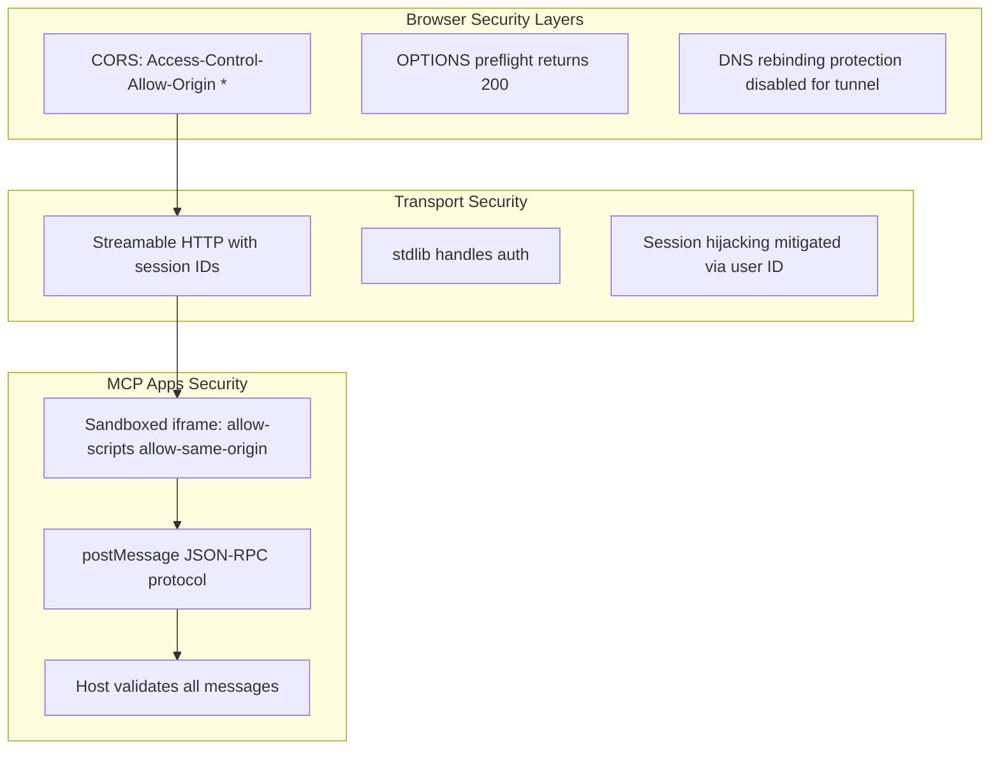

# DESIGN.md — How the System is Built

> **This document describes the implemented design.** Every section maps to actual code in the project.

---

## Design Principles

1. **Self-contained binary** — No runtime dependencies beyond the OS. All assets embedded via `//go:embed` in `internal/tools/dashboard.go` line 14.
2. **Protocol-first** — Follows MCP specification strictly. Deviations cause client incompatibility. See `spec.modelcontextprotocol.io`.
3. **Defense in depth** — CORS middleware → DNS protection → sandboxed iframe → postMessage isolation.
4. **Developer experience** — `make dev-http` starts everything. One command to build, run, test.
5. **Progressive enhancement** — MCP Apps UI for rich clients (Claude Desktop), text response for basic clients (curl), standalone page for browser.

---

## Components

### Go Server Binary (`cmd/dino-mcp/main.go` → `internal/server/`)

The server is a single Go binary (~11MB static, Mach-O 64-bit arm64):

| Layer | Package | Responsibility |
|-------|---------|----------------|
| CLI | `cmd/dino-mcp/main.go` | Parse subcommand, parse flags, start transport |
| Server | `internal/server/server.go` | `New()` creates `mcp.Server`, registers tools + resources, Gin routing, CORS middleware |
| Tools | `internal/tools/think.go + ask.go` | `tools.RegisterThink()`, `tools.RegisterAsk()` using `mcp.AddTool[T,A,R]()` generics |
| Dashboard | `internal/tools/dashboard.go` | `tools.RegisterDashboardTool() + resources.RegisterDashboardResource()` — MCP App tool with `_meta.ui.resourceUri`, embedded HTML via `//go:embed`, dinosaur data (12 `DinoSummary` entries) |
| Gin Router | same file as server | Route table: `/mcp` (MCP protocol), `/dashboard` (standalone HTML), `/api/dinosaurs` (JSON), `/health` (status) |

### HTTP Routing (Gin)

The server uses `github.com/gin-gonic/gin` v1.12.0 as the HTTP router. Key design points:

- **`gin.WrapH()`** bridges the MCP Go SDK's `http.Handler` (`StreamableHTTPHandler`) into Gin's handler chain
- **Middleware chain**: `gin.Recovery()` → `ginLogger()` (slog-based) → `corsMiddleware()` → route handler
- **CORS**: wildcard origin for development MCP Inspector support. OPTIONS returns 200 (not 204) because the Inspector browser requires it.
- **Route grouping**: MCP routes under `/mcp`, static routes under `/dashboard`, API under `/api/`, health under `/health`

### MCP Integration (`github.com/modelcontextprotocol/go-sdk` v1.6.1)

The Go SDK provides:

- **`mcp.Server`**: state machine (Created → InitializeCalled → Initialized → Running → Shutdown)
- **`mcp.AddTool[T,A,R]()`**: generic tool registration with typed Args and Result structs. Args deserialized from JSON, Result serialized to `structuredContent`.
- **`mcp.NewStreamableHTTPHandler()`**: wraps the server for HTTP transport
- **`mcp.StdioTransport{}`**: stdio transport for Claude Desktop
- **Two output modes**:
  - `*mcp.CallToolResult` — text content for the LLM (Markdown-supported)
  - `Result` type — structured JSON for typed client access

### MCP Apps UI (`@modelcontextprotocol/ext-apps` SDK)

The interactive dashboard UI is built with the official ext-apps SDK:

- **`App` class** handles postMessage lifecycle (`ui/initialize` → `ui/notifications/initialized` → tool data → teardown)
- **`PostMessageTransport`** wraps `window.parent.postMessage()` for iframe↔host communication
- **`ontoolinput()** / **`ontoolresult()`** receive structured data from the host
- **`onhostcontextchanged()`** adapts to host theme, fonts, safe areas
- **`callServerTool()`** allows the UI to invoke server tools
- Built via Vite + `vite-plugin-singlefile` into a single 354KB HTML file

### UI Build Pipeline

```
ui/src/mcp-app.ts (TypeScript + ext-apps SDK)
  → Vite + singlefile plugin
  → ui/dist/mcp-app.html (single-file HTML)
  → copied to internal/resources/dashboard_ui.html
  → Go //go:embed at compile time
  → served at runtime via resources/read or GET /dashboard
```

---

## Security Model



- **CORS wildcard** (`Access-Control-Allow-Origin: *`) is for development. For production deployments behind a reverse proxy, restrict to specific origins.
- **`DisableLocalhostProtection: true`** enables Cloudflare Tunnel but bypasses DNS rebinding protection. In production without a tunnel, set to `false`.
- **Sandboxed iframe**: Claude Desktop renders the MCP App HTML in a sandboxed iframe, preventing direct DOM access to the host.
- **Session isolation**: Streamable HTTP uses `Mcp-Session-Id` headers. stdio uses process isolation (each Claude instance gets its own subprocess).

---

## D2 Diagram

```d2
direction: right

dino-mcp: {
  title: "dino-mcp Architecture"
  
  cli: "CLI" {
    stdio: "stdio"
    http: "http"
  }
  
  server: "Go Server" {
    gin: "Gin Router"
    sdk: "MCP SDK"
    tools: "Tools" {
      think: "dino_think"
      ask: "dino_ask"
      dash: "dino_dashboard"
    }
    api: "REST API" {
      dinos: "/api/dinosaurs"
      health: "/health"
    }
    embed: "//go:embed" {
      ui: "dashboard_ui.html"
    }
  }
  
  transports: "Transports" {
    streamable: "Streamable HTTP" {
      endpoint: "/mcp (POST)"
      format: "JSON-RPC"
    }
    stdio_transport: "stdio" {
      format: "JSON-RPC over stdin/stdout"
    }
  }
  
  ui_layer: "UI Layer" {
    mcp_app: "MCP App View" {
      sdk: "@modelcontextprotocol/ext-apps"
      protocol: "ui/initialize protocol"
    }
    standalone: "Standalone" {
      html: "/dashboard page"
      api_fallback: "fetch(/api/dinosaurs)"
    }
  }
  
  clients: "Clients" {
    claude: "Claude Desktop"
    inspector: "MCP Inspector"
    browser: "Web Browser"
  }
  
  cli.http -> server.gin
  stdio_transport -> server.sdk
  streamable.endpoint -> server.gin
  server.gin -> server.sdk: wrapH
  server.gin -> server.api
  server.gin -> server.embed
  server.sdk -> server.tools: register
  server.sdk -> server.embed: resources/read
  
  mcp_app -> streamable: postMessage
  mcp_app --> standalone: fallback
  standalone --> api: fetch JSON
  
  claude -> stdio_transport
  inspector -> streamable
  browser -> streamable
  browser -> standalone
}
```

---

## Personas

### Dino Developer 🦕
*"I want to add a new dinosaur species to the dashboard."*

**Steps**:
1. Add entry to `dinoData` slice in `internal/tools/dashboard.go`
2. Run `make test` → all pass
3. Open `http://localhost:9010/dashboard` → new dino appears
4. Try "Show me the dinosaur dashboard" in Claude → works

### MCP Integrator 🔌
*"I want to use dino-mcp as a reference for my own MCP App server."*

**Steps**:
1. Read `AGENTS.md` → understand tool/resource pattern
2. Read `internal/tools/dashboard.go` → understand `_meta.ui.resourceUri`
3. Read `ui/src/mcp-app.ts` → understand `App` class + `PostMessageTransport`
4. Copy pattern into their own project

### QA Engineer 🧪
*"I want to verify protocol compliance."*

**Steps**:
1. Run `make test` → 7/7 passes
2. Run `make dev-http` + MCP Inspector → all tools work
3. Check MIME type: `resources/read` returns `text/html;profile=mcp-app`
4. Check `_meta`: `tools/list` shows `dino_dashboard` with `ui.resourceUri`

### DevOps Engineer 🚀
*"I want to deploy this to production."*

**Steps**:
1. Set `GIN_MODE=release`
2. Configure reverse proxy (Nginx, Caddy)
3. Run with `./bin/dino-mcp http -addr :8080`
4. Health check at `/health` returns 200
