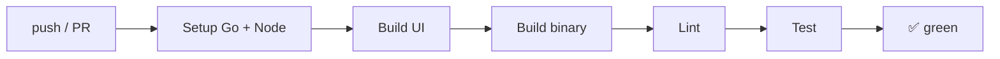
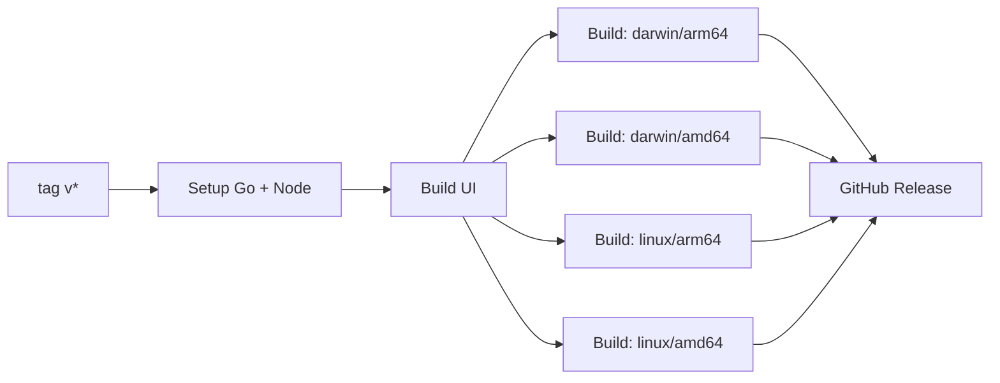

# dino-mcp Development Workflow

> Step-by-step: change → test → verify → commit → CI → release.

---

## Quick Start (already have the repo)

```bash
cd dino-mcp
make dev-http        # builds + runs, http://localhost:9010/dashboard
```

---

## Full Change Workflow

### 1. Decide what to change

| Change | Files | Example |
|--------|-------|---------|
| New tool | `internal/tools/` + `internal/server/server.go` | `dino_ask` |
| New dino species | `internal/tools/dashboard.go` (`dinoData` slice) | Add a new `DinoSummary` |
| Dashboard UI | `ui/src/mcp-app.ts` | Filter logic, card layout |
| Transport / CLI | `cmd/dino-mcp/main.go` + `internal/server/server.go` | Add `--port` flag |
| Docs | `docs/` (Diátaxis structure) | Add a how-to guide |

### 2. Branch

```bash
git checkout -b feat/my-thing
```

### 3. Code → Build → Test loop

```bash
# Build + run (≈3s cycle)
make build-fast && make dev-http

# In another terminal, test with curl
curl http://localhost:9010/api/dinosaurs | jq

# Run full integration test suite
make test
# Expected: 7/7 tests passing

# Lint
make lint
```

### 4. UI changes (if applicable)

```bash
# Full build (Vite + Go, ≈10s)
make build

# Run in HTTP mode to see the UI
make dev-http
# Open http://localhost:9010/dashboard

# For live UI iteration, edit ui/src/mcp-app.ts and rebuild
make build-ui        # Vite only (≈2s)
make build-go        # Re-embed into binary
```

### 5. Verify everything

```bash
# 1. Build works
make clean && make build

# 2. Binary runs
./bin/dino-mcp help

# 3. HTTP mode serves dashboard
./bin/dino-mcp http -addr :9010 -verbose &
PID=$!
sleep 1
curl -s http://localhost:9010/dashboard | head -5
curl -s http://localhost:9010/api/dinosaurs | python3 -c "import json,sys; d=json.load(sys.stdin); print(f'{len(d)} dinosaurs')"

# 4. Integration tests pass
make test

# 5. Lint clean
make lint

# Cleanup
kill $PID 2>/dev/null
```

### 6. Commit

```bash
# Standard commit format
git add -A
git commit -m "feat: add my new thing

- Short description of changes
- Why it matters
- Any breaking changes noted"
```

### 7. Push → CI

```bash
git push origin feat/my-thing
```

CI runs automatically on push/PR (`.github/workflows/ci.yml`):

```
✅ Build UI (Vite)
✅ Build binary (Go)
✅ Lint (go vet + go fmt)
✅ Test (7 integration tests)
```

Fix any red ❌ before merging.

### 8. Merge

```bash
# Update from main
git checkout main
git pull

# Merge
git merge feat/my-thing
git push
```

---

## Release Workflow

When ready to ship a new version:

```bash
# 1. Tag
git tag -a v1.2.0 -m "v1.2.0: what changed"

# 2. Push tag
git push origin v1.2.0
```

CI (`.github/workflows/release.yml`) builds binaries for all platforms:

| Platform | Binary |
|----------|--------|
| macOS arm64 | `dino-mcp-darwin-arm64` |
| macOS amd64 | `dino-mcp-darwin-amd64` |
| Linux amd64 | `dino-mcp-linux-amd64` |
| Linux arm64 | `dino-mcp-linux-arm64` |

And creates a GitHub Release with auto-generated notes.

---

## CI Pipeline Reference

### CI (push/PR to main)



### Release (tag v*)



---

## Common Change Types

| Prefix | When | Example commit |
|--------|------|----------------|
| `feat:` | New feature | `feat: add dino_size tool` |
| `fix:` | Bug fix | `fix: dino_ask returns 404 on empty question` |
| `docs:` | Documentation | `docs: add deployment guide` |
| `refactor:` | Code change (no feature/fix) | `refactor: extract dino data into separate file` |
| `chore:` | Tooling, deps, CI | `chore: bump MCP Go SDK to v1.7.0` |
| `style:` | Formatting only | `style: go fmt` |

---

## Need Help?

```bash
make help      # All make targets
make lint      # Check code quality
make test      # Run integration tests
```
