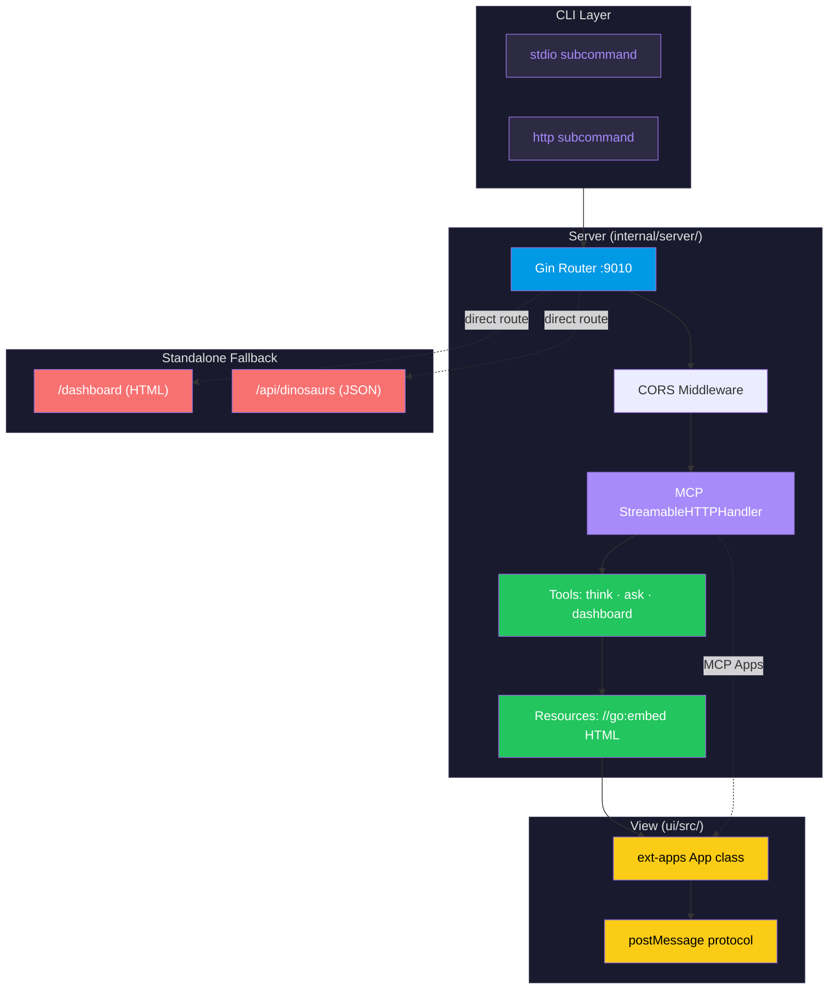

<p align="center">
  <picture>
    <source media="(prefers-color-scheme: dark)" srcset="https://img.shields.io/badge/🦕-dino--mcp-8b5cf6?style=for-the-badge&labelColor=1a1a2e&color=a78bfa">
    
  </picture>
</p>

<p align="center">
  <em>A production-grade MCP server with interactive HTML dashboard UI —
  written in Go, styled for delight.</em>
</p>

<div align="center">

[](https://go.dev)
[](https://github.com/modelcontextprotocol/go-sdk)
[](https://github.com/gin-gonic/gin)
[](test_mcp.sh)
[](LICENSE)
[](#)

</div>

---

## 📋 Table of Contents

- [What — and Why](#-what--and-why)
- [Quick Start](#-quick-start)
- [Architecture at a Glance](#-architecture-at-a-glance)
- [Features](#-features)
- [Try It](#-try-it)
- [Tool Reference](#-tool-reference)
- [Claude Desktop Integration](#-claude-desktop-integration)
- [Development](#-development)
- [Documentation Map](#-documentation-map)
- [Project Status](#-project-status)

---

## 🦕 What — and Why

**dino-mcp** is a reference implementation of the **Model Context Protocol (MCP)** in Go that demonstrates every layer of the modern MCP stack:

| Layer | Implementation | Why it matters |
|-------|---------------|----------------|
| **Transport** | `stdio` + `Streamable HTTP` | Works in Claude Desktop AND web browsers |
| **MCP Apps** | `@modelcontextprotocol/ext-apps` `App` class | Interactive HTML UIs in Claude Desktop iframes |
| **Tools** | `dino_think`, `dino_ask`, `dino_dashboard` | Typed Go handlers, structured JSON results |
| **Resources** | `//go:embed` HTML → `text/html;profile=mcp-app` | Self-contained ~11MB binary, zero deps at runtime |

> Whether you're building an MCP server from scratch, learning the MCP Apps protocol, or need a Go — Gin — ext-apps SDK integration blueprint, this project has you covered.

---

## ⚡ Quick Start

```bash
# Clone & enter
git clone https://github.com/shennawardana23/mcp-dino.git && cd mcp-dino

# Build & run in one shot (≈2 seconds)
make build-fast && make dev-http

# Open the standalone dashboard
open http://localhost:9010/dashboard
```

<details>
<summary><b>Expected output</b> — click to expand</summary>

```
=== dino-mcp server ===
Transport: http
Listening on :9010

[GIN] 2026/06/21 - 12:30:00 | 200 | 4.2ms | ::1 | GET "/dashboard"
[GIN] 2026/06/21 - 12:30:01 | 200 | 2.1ms | ::1 | GET "/api/dinosaurs"
```
</details>

---

## 🏗 Architecture at a Glance



**Data flows through three pipes:**

| Pipe | Protocol | Client | Use case |
|------|----------|--------|----------|
| **MCP Tools** | JSON-RPC over stdio | Claude Desktop | Text tools (`dino_think`, `dino_ask`) |
| **MCP Apps** | JSON-RPC over stdio + postMessage | Claude Desktop iframe | Interactive UI (`dino_dashboard`) |
| **Standalone** | HTTP GET | Browser | Direct access (`/dashboard`, `/api/dinosaurs`) |

---

## ✨ Features

<details open>
<summary><b>MCP Standards Compliance</b></summary>

| Feature | Status | Notes |
|---------|--------|-------|
| Tools (`tools/list`, `tools/call`) | ✅ Complete | 3 typed tools with structured JSON responses |
| Resources (`resources/list`, `resources/read`) | ✅ Complete | `//go:embed` HTML served at `ui://` URIs |
| MCP Apps protocol | ✅ Complete | `_meta.ui.resourceUri` + `ui/initialize` handshake |
| stdio transport | ✅ | Claude Desktop, Cursor, Copilot |
| Streamable HTTP | ✅ | MCP Inspector, curl, browser, tunnel |
| SSE transport | ❌ Removed | Deprecated in MCP spec v2025-11-25 |

</details>

<details>
<summary><b>Developer Experience</b></summary>

- **3-second build cycle** — `make build-fast && make dev-http`
- **7 integration tests** — `make test` exercises every protocol method
- **Interactive debugging** — `make test-inspector` launches [MCP Inspector](https://github.com/modelcontextprotocol/inspector)
- **Remote testing** — `make run-tunnel` creates a public `trycloudflare.com` URL
- **No API keys** — all dinosaur data is built into the binary
- **Zero runtime deps** — single static binary with embedded HTML

</details>

<details>
<summary><b>Interactive Dashboard</b></summary>

The `dino_dashboard` tool renders an HTML card grid inside Claude Desktop's iframe:

- **Filter by diet** — Carnivore, Herbivore, or show All
- **Filter by period** — Triassic, Jurassic, Cretaceous
- **12 dinosaur species** — from T-Rex to Velociraptor
- **Fallback mode** — open directly at `http://localhost:9010/dashboard`

> Note: the filter is applied server-side at the time the tool is called. Once opened with a specific filter, the in-app filter buttons can only narrow further within that same result set — they can't widen back out to species the initial call excluded.

The HTML view is built with the official `@modelcontextprotocol/ext-apps` SDK and communicates via JSON-RPC over `postMessage`.

</details>

---

## 🎮 Try It

### In Claude Desktop

```
Show me the dinosaur dashboard with carnivores
```

→ Claude detects the MCP App → renders an iframe → you see filterable dinosaur cards

### In your browser

```bash
open http://localhost:9010/dashboard
```

→ Standalone HTML with all dinosaur data fetched from the built-in REST API

### With MCP Inspector

```bash
make test-inspector
```

→ Opens `http://localhost:5173` → connects to `http://localhost:9010/mcp`

### Via curl

```bash
# Initialize
curl -s -X POST http://localhost:9010/mcp \
  -H "Content-Type: application/json" \
  -H "Accept: application/json, text/event-stream" \
  -d '{"jsonrpc":"2.0","id":1,"method":"initialize","params":{"protocolVersion":"2025-06-18","capabilities":{},"clientInfo":{"name":"curl","version":"1.0"}}}' \
  | python3 -m json.tool

# List tools
SID="<session-id-from-above>"
curl -s -X POST http://localhost:9010/mcp \
  -H "Content-Type: application/json" \
  -H "Accept: application/json, text/event-stream" \
  -H "Mcp-Session-Id: $SID" \
  -d '{"jsonrpc":"2.0","id":2,"method":"tools/list"}' \
  | python3 -m json.tool

# Call dino_think
curl -s -X POST http://localhost:9010/mcp \
  -H "Content-Type: application/json" \
  -H "Accept: application/json, text/event-stream" \
  -H "Mcp-Session-Id: $SID" \
  -d '{"jsonrpc":"2.0","id":3,"method":"tools/call","params":{"name":"dino_think","arguments":{}}}' \
  | python3 -m json.tool
```

---

## 🔧 Tool Reference

| Tool | Type | Input | Output | Example Prompt |
|------|------|-------|--------|----------------|
| `dino_think` | Text | `{}` | Random fact + species JSON | "Tell me a dinosaur fact" |
| `dino_ask` | Text | `{"question": "..."}` | Answer + question JSON | "What did T-Rex eat?" |
| `dino_dashboard` | **MCP App** | `{"filter": "Carnivore"}` | HTML iframe + JSON data | "Show me carnivore dinosaurs" |

> `dino_ask` currently returns the same general dinosaur-era overview regardless of the question asked — it doesn't yet branch on the question text. Tracked as a known limitation.

Example `dino_think` response:

```json
{
  "content": [
    { "type": "text", "text": "🦕 Did you know? The Velociraptor was only about the size of a turkey!" }
  ],
  "structuredContent": {
    "fact": "The Velociraptor was only about the size of a turkey",
    "species": "Velociraptor"
  }
}
```

Example `dino_dashboard` response:

```json
{
  "content": [
    { "type": "text", "text": "Displaying dinosaur dashboard with 4 dinosaurs (filter: Carnivore)" }
  ],
  "structuredContent": {
    "filter": "Carnivore",
    "dinosaurs": [
      {
        "name": "Tyrannosaurus Rex",
        "period": "Cretaceous",
        "diet": "Carnivore",
        "length": "40 ft (12 m)",
        "weight": "9 tons (8,000 kg)",
        "funFact": "T-Rex had the strongest bite of any land animal ever",
        "imageStyle": "bg-red-900"
      }
    ],
    "timestamp": "2026-06-21T12:00:00Z"
  }
}
```

---

## 💬 Claude Desktop Integration

### CLI Mode (stdin/stdout)

Locate the binary and add to your `claude_desktop_config.json`:

```json
{
  "mcpServers": {
    "dino-mcp": {
      "command": "/absolute/path/to/mcp-dino/bin/dino-mcp",
      "args": ["stdio"]
    }
  }
}
```

After saving, restart Claude Desktop. You'll see hammer icons (🔨) on tools when chatting — click to invoke directly, or let Claude decide.

### HTTP Mode (for debugging)

```bash
make dev-http
# Server starts on :9010
```

---

## 🛠 Development

### Prerequisites

| Tool | Version | Purpose |
|------|---------|---------|
| [Go](https://go.dev/dl/) | ≥ 1.25 | Server binary |
| [Node.js](https://nodejs.org/) | ≥ 18 | UI build (Vite) |
| [cloudflared](https://developers.cloudflare.com/cloudflare-one/connections/connect-networks/downloads/) | any | Tunnel for remote testing |

### Commands

```bash
# Build — three options
make build            # Full: Vite UI + Go binary
make build-fast       # Quick: Go binary only (reuses existing UI)
make build-ui         # Vite UI only

# Run
make dev-http         # HTTP mode with verbose logging
make run-stdio        # stdio mode for Claude Desktop
make run-tunnel       # HTTP + Cloudflare Tunnel

# Test & verify
make test             # 7 integration tests — all must pass
make test-inspector   # Launch MCP Inspector in browser
make lint             # go vet + go fmt

# Utility
make help             # All targets with descriptions
make clean            # Remove all build artifacts
```

### Project Structure

```
mcp-dino/
├── bin/                          # Go build output (~11MB static binary)
├── cmd/dino-mcp/main.go          # CLI entry point (stdio | http | help)
├── internal/
│   ├── server/
│   │   └── server.go             # Composition root: mcp.Server + Gin + CORS
│   ├── tools/
│   │   ├── tools.go              # Shared types, constants, helpers
│   │   ├── think.go              # RegisterThink (dino_think tool)
│   │   ├── ask.go                # RegisterAsk (dino_ask tool)
│   │   └── dashboard.go          # RegisterDashboardTool + 12 dino species + REST API
│   └── resources/
│       ├── dashboard.go          # RegisterDashboardResource + //go:embed HTML
│       └── dashboard_ui.html     # Vite-built HTML (354KB)
├── ui/
│   └── src/
│       └── mcp-app.ts            # ext-apps App class + postMessage
├── docs/                         # Diátaxis documentation (see below)
├── test_mcp.sh                   # 7 integration tests
├── AGENTS.md                     # AI agent instructions (canonical)
├── ARCHITECTURE.md               # C4 diagrams + sequence flows
├── TECH_DESIGN.md                # Interface contracts + data model
├── Makefile                      # All targets
├── go.mod + go.sum               # Go dependencies
└── README.md                     # ← you are here
```

---

## 🗺 Documentation Map

dino-mcp uses the **Diátaxis framework** — four documentation modes, each serving a different need.

| For this audience | Start here | Audience |
|:---|---:|:---|
| 👋 New to the project | [Quick Start](docs/tutorials/get-started.md) | Everyone |
| 🧑‍💻 Adding a tool | [Your First Tool](docs/tutorials/first-tool.md) | Developers |
| 🦕 Adding a dinosaur | [Add a Dinosaur](docs/how-to/add-dinosaur.md) | Content editors |
| 🧪 Testing with Inspector | [Test with Inspector](docs/how-to/test-inspector.md) | QA / Developers |
| 🔍 Reference needed | [CLI Reference](docs/reference/cli.md) | Operators |
| 🏗 Understanding design | [Architecture](docs/explanation/architecture.md) | Architects |
| 🤖 Implementing via AI | [AGENTS.md](AGENTS.md) | AI coding agents |
| 📚 Deep architecture | [ARCHITECTURE.md](ARCHITECTURE.md) | Senior engineers |
| 📐 Technical specs | [TECH_DESIGN.md](TECH_DESIGN.md) | Implementation teams |
| ⏳ Development history | [MEMORY.md](MEMORY.md) | All contributors |
| 📋 Roadmap | [PLAN.md](PLAN.md) | Stakeholders |
| ⚖️ Design trade-offs | [DESIGN.md](DESIGN.md) | Architects |
| 🎯 Skills reference | [SKILL.md](SKILL.md) | Developers / AI agents |
| 🤝 How to contribute | [CONTRIBUTOR.md](CONTRIBUTOR.md) | Contributors |
| 📜 Code of conduct | [CODE_CONDUCT.md](CODE_CONDUCT.md) | Community |
| 📄 ADRs | [docs/adr/](docs/adr/) | Decision historians |
| 🤖 LLM full context | [llms-full.txt](llms-full.txt) | AI agents (RAG) |

---

## 📊 Project Status

```
MVP ── Production ── Enhanced UI ── Ecosystem ── Advanced
  ●                    ○               ○             ○
```

| Phase | Status | Highlights |
|-------|--------|------------|
| **MVP** | ✅ Complete | 3 tools, MCP Apps UI, 7 tests, docs |
| **Production** | 🔄 In progress | Go unit tests, CI, rate limiting, Docker |
| **Enhanced UI** | 📅 Planned | Real-time data, comparison, timeline |
| **Ecosystem** | 📅 Planned | Homebrew, GitHub releases, MCP Registry |
| **Advanced** | 💭 Future | Streaming tool inputs, WebSocket sync |

### Build Metrics

| Metric | Value |
|--------|-------|
| Binary size | ~11 MB (compressed) |
| Binary type | Mach-O 64-bit arm64 |
| Go version | 1.25 |
| MCP SDK version | v1.7.0 |
| Dependencies | 30+ Go modules (all indirect) |
| UI bundle | 354 KB embedded HTML (single-file Vite) |
| Test coverage | 7/7 integration tests passing (shell-based; no Go unit tests yet) |

---

## 📖 Further Reading

| Resource | Link |
|----------|------|
| MCP Specification | [spec.modelcontextprotocol.io](https://spec.modelcontextprotocol.io) |
| MCP Go SDK | [github.com/modelcontextprotocol/go-sdk](https://github.com/modelcontextprotocol/go-sdk) |
| MCP Apps Protocol | [modelcontextprotocol.io/docs/apps/overview](https://modelcontextprotocol.io/docs/apps/overview) |
| ext-apps SDK | [github.com/modelcontextprotocol/ext-apps](https://github.com/modelcontextprotocol/ext-apps) |
| Gin Web Framework | [github.com/gin-gonic/gin](https://github.com/gin-gonic/gin) |
| Go Programming Language | [go.dev](https://go.dev) |

---

<p align="center">
  Built with ❤️ using <a href="https://go.dev">Go</a>,
  <a href="https://gin-gonic.com">Gin</a>,
  <a href="https://github.com/modelcontextprotocol/go-sdk">MCP Go SDK</a>,
  and <a href="https://github.com/modelcontextprotocol/ext-apps">@modelcontextprotocol/ext-apps</a>
</p>
