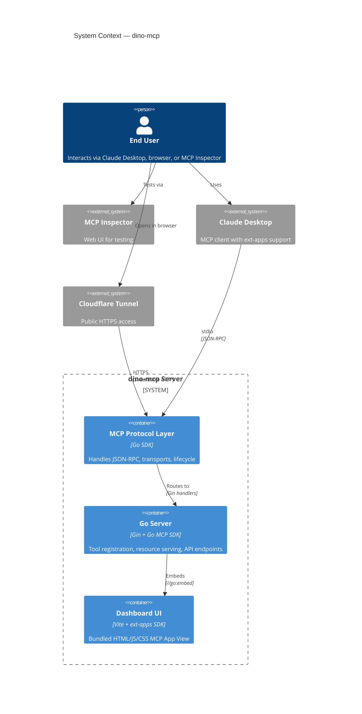
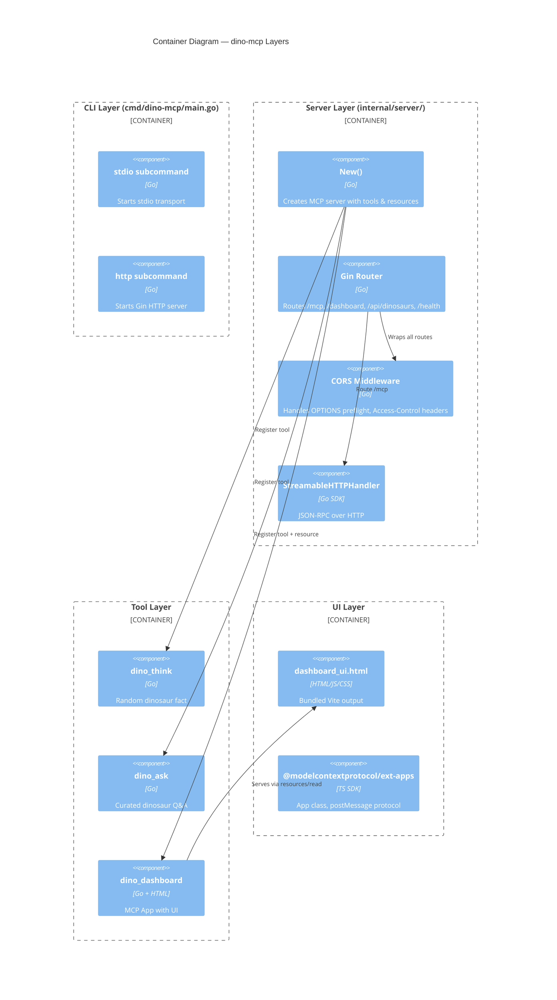
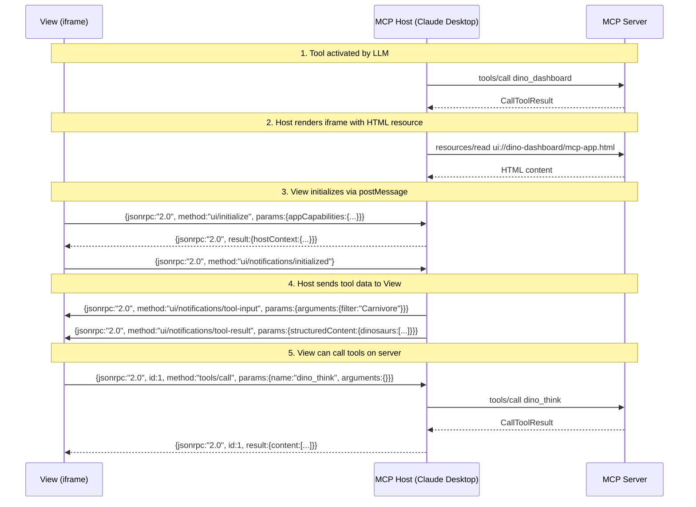
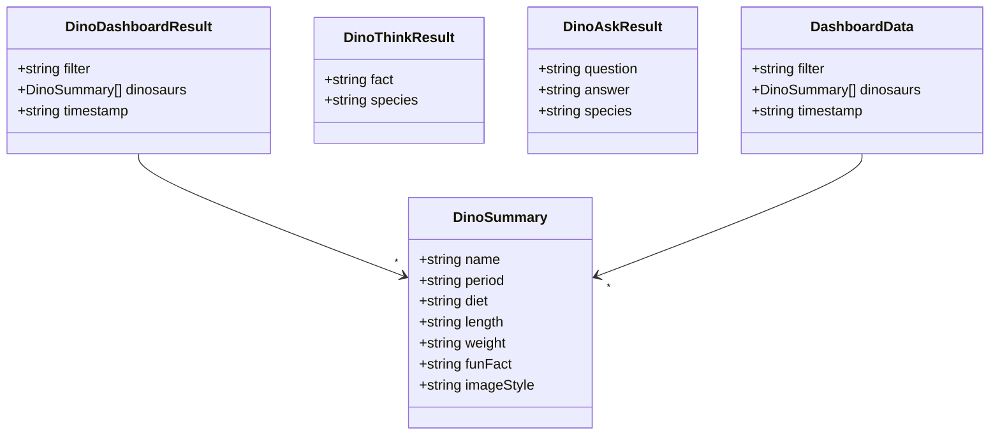

# SYSTEM.md — dino-mcp System Architecture

> **Architecture deep-dive for AI agents and developers.** Understand every layer, data flow, and interaction pattern.

---

## System Overview



---

## Architecture Layers



---

## Request Flow

```mermaid
sequenceDiagram
  participant Client as MCP Client (Claude Desktop)
  participant HTTP as Gin Router (:9010)
  participant MCP as StreamableHTTPHandler
  participant Server as mcp.Server
  participant Tool as Tool Handler
  participant Resource as Resource Handler

  Note over Client,Resource: INITIALIZATION
  Client->>HTTP: POST /mcp (initialize)
  HTTP->>MCP: gin.WrapH(handler)
  MCP->>Server: Handle JSON-RPC
  Server-->>MCP: InitializeResult (session ID)
  MCP-->>HTTP: HTTP 200 + SSE/JSON
  HTTP-->>Client: Mcp-Session-Id header

  Note over Client,Resource: TOOL LISTING
  Client->>HTTP: POST /mcp (tools/list)
  HTTP->>MCP: gin.WrapH(handler)
  MCP->>Server: List tools
  Server-->>MCP: tools (with _meta.ui on dino_dashboard)
  MCP-->>Client: Response

  Note over Client,Resource: TOOL CALL (dino_dashboard)
  Client->>HTTP: POST /mcp (tools/call dino_dashboard)
  HTTP->>MCP: gin.WrapH(handler)
  MCP->>Server: Execute tool
  Server->>Tool: Call handler
  Tool-->>Server: DinoDashboardResult
  Server-->>MCP: CallToolResult
  MCP-->>Client: Result + structuredContent

  Note over Client,Resource: UI RESOURCE FETCH
  Client->>HTTP: POST /mcp (resources/read)
  HTTP->>MCP: gin.WrapH(handler)
  MCP->>Server: Read resource
  Server->>Resource: Read embedded HTML
  Resource-->>Server: dashboard_ui.html content
  Server-->>MCP: ResourceContents (text/html;profile=mcp-app)
  MCP-->>Client: HTML with postMessage protocol

  Note over Client,Resource: STANDALONE BROWSER
  Browser->>HTTP: GET /dashboard
  HTTP->>Server: Gin handler
  Server->>Resource: Read embedded HTML
  Resource-->>Server: dashboard_ui.html content
  Server-->>Browser: HTML page
  Browser->>HTTP: GET /api/dinosaurs?filter=Carnivore
  HTTP->>Server: Gin handler
  Server-->>Browser: JSON dinosaur data
```

---

## MCP Apps Protocol (View ↔ Host)



---

## Transport Modes

### stdio (Claude Desktop)
```
┌──────────────┐     stdin/stdout     ┌──────────────┐
│ Claude       │◄────────────────────►│ dino-mcp     │
│ Desktop      │   JSON-RPC messages  │ (stdio mode) │
└──────────────┘                      └──────────────┘
```

### Streamable HTTP (Web/MCP Inspector)
```
┌──────────────┐                     ┌──────────────┐
│ MCP Client   │── POST /mcp ──────►│ Gin Router   │
│ (curl,       │◄── HTTP response ──│ (:9010)      │
│  Inspector)  │                     └──────┬───────┘
└──────────────┘                             │
                                     ┌──────▼───────┐
                                     │ Streamable   │
                                     │ HTTP Handler │
                                     └──────────────┘
```

### Cloudflare Tunnel
```
┌──────────────┐    HTTPS     ┌──────────────┐    HTTP     ┌──────────────┐
│ Browser /    │─────────────►│ Cloudflare   │────────────►│ dino-mcp     │
│ Client       │◄─────────────│ Tunnel       │◄────────────│ (:9010)      │
└──────────────┘              └──────────────┘              └──────────────┘
```

---

## Data Model



---

## Route Table

| Route | Method | Handler | Purpose |
|-------|--------|---------|---------|
| `/mcp` | ANY | `StreamableHTTPHandler` | MCP JSON-RPC endpoint |
| `/mcp/*any` | ANY | `StreamableHTTPHandler` | MCP JSON-RPC (subpath) |
| `/dashboard` | GET | Serves embedded HTML | Standalone UI |
| `/dashboard/*any` | GET | Serves embedded HTML | Standalone UI (subpath) |
| `/api/dinosaurs` | GET | Filtered JSON data | Standalone API |
| `/api/dinosaurs?filter=` | GET | Filtered JSON data | Standalone API |
| `/health` | GET | JSON status | Health check |

---

## Environment Variables

| Variable | Default | Purpose |
|----------|---------|---------|
| `GIN_MODE` | (none) | Set to `release` for production |
| `DINO_VERBOSE` | (none) | Enable debug logging |
| (none — public binary) | | No API keys required |

---

## Dependencies

### Go (runtime)
| Module | Version | Purpose |
|--------|---------|---------|
| `github.com/modelcontextprotocol/go-sdk` | v1.6.1 | MCP core protocol (tools, resources, transports) |
| `github.com/gin-gonic/gin` | v1.12.0 | HTTP router, middleware, CORS |

### Node.js (build-time)
| Package | Version | Purpose |
|---------|---------|---------|
| `@modelcontextprotocol/ext-apps` | latest | MCP Apps SDK (App class, PostMessageTransport) |
| `vite` | ^6.0.0 | Bundler with singlefile plugin |
| `vite-plugin-singlefile` | latest | Inline all assets into one HTML file |

### External (dev/test)
| Tool | Purpose |
|------|---------|
| `cloudflared` | Public HTTPS tunnel for remote testing |
| `npx @modelcontextprotocol/inspector` | MCP Inspector for interactive debugging |
| `curl` / `python3` | Integration test script |
