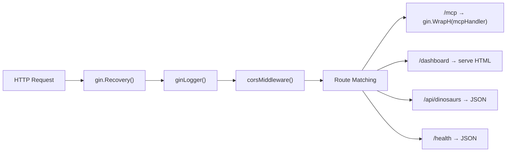
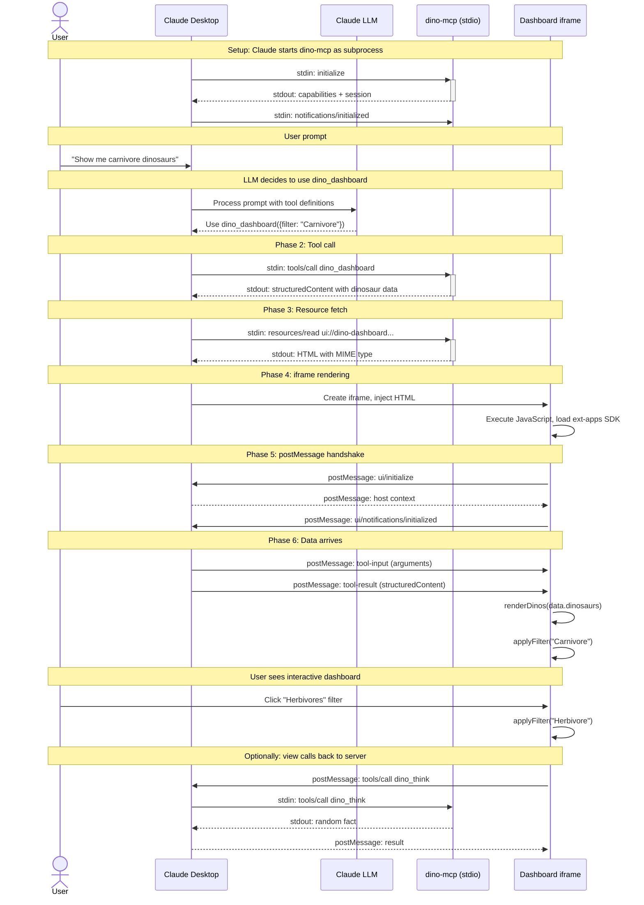
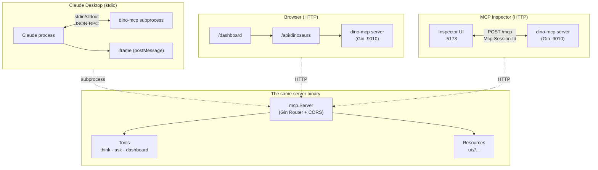

# Explanation: Architecture & MCP Protocol Deep-Dive

> **How dino-mcp works, inside-out.** This document explains every protocol interaction, every layer in the stack, and how MCP Apps bring interactive HTML UIs into Claude Desktop.

**Official references:**
- [MCP Specification](https://spec.modelcontextprotocol.io) — full protocol spec
- [MCP Apps — Overview](https://modelcontextprotocol.io/extensions/apps/overview) — interactive HTML views in MCP
- [MCP UI Community](https://mcpui.dev) — gallery of MCP Apps, tools, patterns
- [MCP Go SDK](https://github.com/modelcontextprotocol/go-sdk) — Go implementation of the spec
- [ext-apps SDK](https://github.com/modelcontextprotocol/ext-apps) — TypeScript SDK for building MCP App views
- [Gin Web Framework](https://gin-gonic.com) — Go HTTP router used here

---

## Table of Contents

- [1. MCP Protocol Flow (JSON-RPC Messages)](#1-mcp-protocol-flow-json-rpc-messages)
- [2. MCP Apps Protocol (postMessage + ext-apps SDK)](#2-mcp-apps-protocol-postmessage--ext-apps-sdk)
- [3. Go SDK Internals](#3-go-sdk-internals)
- [4. Gin Bridge and HTTP Layer](#4-gin-bridge-and-http-layer)
- [5. End-to-End Request Flow](#5-end-to-end-request-flow)
- [6. Client Connection Modes](#6-client-connection-modes)

---

## 1. MCP Protocol Flow (JSON-RPC Messages)

The Model Context Protocol uses [JSON-RPC 2.0](https://www.jsonrpc.org/specification) messages over a transport (stdio or HTTP). Every interaction follows this lifecycle:

```mermaid
sequenceDiagram
    participant C as MCP Client
    participant S as MCP Server (dino-mcp)
    
    Note over C,S: LIFECYCLE: Initialize → Notify → Use → Shutdown
    
    C->>S: initialize {"protocolVersion":"2025-11-05","capabilities":{...},"clientInfo":{...}}
    S-->>C: result {"protocolVersion":"2025-11-05","serverInfo":{"name":"dino-mcp"},"capabilities":{...}}
    
    C->>S: notifications/initialized (no response expected)
    
    Note over C,S: TOOL DISCOVERY
    
    C->>S: tools/list
    S-->>C: result {"tools":[{"name":"dino_think",...},{"name":"dino_dashboard",...}]}
    
    Note over C,S: TOOL EXECUTION
    
    C->>S: tools/call {"name":"dino_think","arguments":{}}
    S-->>C: result {"content":[{"type":"text","text":"..."},{"type":"structured","structuredContent":{...}}]}
    
    Note over C,S: RESOURCE ACCESS (MCP Apps)
    
    C->>S: resources/read {"uri":"ui://dino-dashboard/mcp-app.html"}
    S-->>C: result {"contents":[{"uri":"...","mimeType":"text/html;profile=mcp-app","text":"[HTML content]"}]}
```

### 1.1 Initialize

The client sends `initialize` with its capabilities. The server responds with its own capabilities.

**What dino-mcp reports** (from the Go SDK, set up in `server.go` `New()`):

```
Server capabilities:
  tools:    {}        ("tool list changed" support)
  resources: {}       ("subscribe" support)
  logging:  {}        (logging support)
```

### 1.2 Tools/List

The client discovers available tools. dino-mcp returns three tools.

**The critical MCP Apps detail** — `dino_dashboard` has a `_meta.ui.resourceUri` field:

```json
{
  "name": "dino_dashboard",
  "description": "Opens an interactive dinosaur dashboard...",
  "inputSchema": {
    "type": "object",
    "properties": {
      "filter": { "type": "string", "description": "Optional filter..." }
    }
  },
  "_meta": {
    "ui": {
      "resourceUri": "ui://dino-dashboard/mcp-app.html"
    }
  }
}
```

This is set in `dashboard.go` lines 64-68:

```go
Meta: mcp.Meta{
    "ui": map[string]any{
        "resourceUri": RESOURCE_URI,   // "ui://dino-dashboard/mcp-app.html"
    },
},
```

When the MCP host (Claude Desktop) sees `_meta.ui.resourceUri`, it:
1. Knows this tool has an interactive UI
2. Will fetch the resource via `resources/read`
3. Render the HTML in an iframe
4. Establish postMessage communication

### 1.3 Tools/Call

The client invokes a tool. The handler returns both text content and structured content.

**Dual-output pattern** (seen in `think_tool.go` and `dashboard.go`):

```go
// dino_think handler returns:
return nil,                       // nil CallToolResult → auto-built from Result type
    DinoThinkResult{              // → becomes structuredContent
        Fact:    fact.fact,
        Species: fact.species,
    },
    nil                           // no error

// dino_dashboard handler returns:
return &mcp.CallToolResult{       // explicit CallToolResult with text content
    Content: []mcp.Content{
        &mcp.TextContent{
            Text: fmt.Sprintf("Displaying dinosaur dashboard with %d dinosaurs...", ...),
        },
    },
}, DinoDashboardResult{...}, nil  // structured content
```

### 1.4 Resources/Read

The client fetches an HTML resource identified by the `ui://` URI scheme.

**Resource handler** (from `dashboard.go` lines 35-50):

```go
s.AddResource(&mcp.Resource{
    URI:         "ui://dino-dashboard/mcp-app.html",
    Name:        "Dino Dashboard",
    Description: "Interactive dinosaur dashboard with filterable cards...",
    MIMEType:    "text/html;profile=mcp-app",
}, func(ctx context.Context, req *mcp.ReadResourceRequest) (*mcp.ReadResourceResult, error) {
    htmlData, err := uiFS.ReadFile("dashboard_ui.html")
    if err != nil {
        return nil, mcp.ResourceNotFoundError(req.Params.URI)
    }
    return &mcp.ReadResourceResult{
        Contents: []*mcp.ResourceContents{
            {
                URI:      req.Params.URI,
                MIMEType: "text/html;profile=mcp-app",
                Text:     string(htmlData),
            },
        },
    }, nil
})
```

### 1.5 Transport Modes

dino-mcp implements two transports defined by the MCP spec. Both carry identical JSON-RPC messages but differ in how bytes are transferred:

#### stdio Transport

**Implementation** (`internal/server/server.go` line 73):
```go
func RunStdio(ctx context.Context, s *mcp.Server, logger *slog.Logger) error {
    logger.Info("starting dino-mcp on stdio transport")
    return s.Run(ctx, &mcp.StdioTransport{})
}
```

- Channel: stdin/stdout pipes within the host process
- Session: implicit — one process lifetime equals one session
- Blocking call: the `s.Run()` call blocks until the context is cancelled (SIGINT/SIGTERM)
- Target clients: Claude Desktop, Cursor, Copilot, any tool that spawns subprocesses
- Stderr logging: all log output goes to stderr, keeping stdout clean for JSON-RPC

#### Streamable HTTP Transport

**Implementation** (`internal/server/server.go` lines 77-130):
```go
func RunStreamableHTTP(ctx context.Context, s *mcp.Server, addr string, logger *slog.Logger) error {
    gin.SetMode(gin.ReleaseMode)
    r := gin.New()
    r.Use(gin.Recovery())
    r.Use(ginLogger(logger))
    r.Use(corsMiddleware())
    
    mcpHandler := mcp.NewStreamableHTTPHandler(
        func(r *http.Request) *mcp.Server { return s },
        &mcp.StreamableHTTPOptions{
            Logger:                    logger,
            DisableLocalhostProtection: true,
        },
    )
    r.Any("/mcp", gin.WrapH(mcpHandler))
    r.Any("/mcp/*any", gin.WrapH(mcpHandler))
    // ... dashboard, API, health routes ...
}
```

- Channel: HTTP POST requests to `/mcp` on the configured address (default `:9010`)
- Session: explicit — `Mcp-Session-Id` header returned on `initialize`, required on subsequent requests
- Accept header validation: client must send `Accept: application/json, text/event-stream` (both MIME types required by the SDK)
- Response format: immediate responses use JSON (`Content-Type: application/json`); long-running operations can stream via SSE if the client accepts it
- DNS protection: `DisableLocalhostProtection: true` allows Cloudflare Tunnel to forward requests (non-localhost Host header to localhost listener)
- Target clients: MCP Inspector, curl/wget, browser-based tools, Cloudflare Tunnel

---

## 2. MCP Apps Protocol (postMessage + ext-apps SDK)

The MCP Apps protocol extends MCP with interactive HTML views. While regular MCP tools return text, MCP App tools return *structured data that drives an interactive UI*.

### 2.1 The Protocol Stack

```mermaid
sequenceDiagram
    participant LLM as LLM Agent
    participant Host as MCP Host<br/>(Claude Desktop)
    participant Svr as dino-mcp Server
    participant View as View (iframe)
    
    Note over LLM,View: PHASE 1: LLM decides to use the dashboard tool
LLM->>Host: "Show me carnivore dinosaurs"
    
    Note over LLM,View: PHASE 2: Host calls the tool
Host->>Svr: tools/call dino_dashboard {filter: "Carnivore"}
Svr-->>Host: {content: [text, structured], structuredContent: {dinosaurs: [...], filter: "Carnivore"}}
    
    Note over LLM,View: PHASE 3: Host detects MCP App UI
Host->>Svr: resources/read ui://dino-dashboard/mcp-app.html
Svr-->>Host: {mimeType: "text/html;profile=mcp-app", text: "[HTML bundle]"}
    
    Note over LLM,View: PHASE 4: Host renders the HTML in an iframe
Host->>View: Create sandboxed iframe with HTML content
    
    Note over LLM,View: PHASE 5: View initializes (postMessage)
View->>Host: {jsonrpc, method: "ui/initialize", params: {appCapabilities: {...}}}
Host-->>View: {jsonrpc, result: {hostContext: {...}}}
View->>Host: {jsonrpc, method: "ui/notifications/initialized"}
    
    Note over LLM,View: PHASE 6: Host sends tool data to View
Host->>View: {method: "ui/notifications/tool-input", params: {arguments: {filter: "Carnivore"}}}
Host->>View: {method: "ui/notifications/tool-result", params: {structuredContent: {dinosaurs: [...], filter: "Carnivore"}}}
    
    Note over LLM,View: PHASE 7: View renders cars
View->>View: renderDinos(data.dinosaurs)
    
    Note over LLM,View: PHASE 8: User can call tools FROM the View
View->>Host: {method: "tools/call", id: 1, params: {name: "dino_think", arguments: {}}}
Host->>Svr: tools/call dino_think
Svr-->>Host: {result: {content: [{type: "text"}]}}
Host-->>View: {jsonrpc, id: 1, result: {content: [{type: "text"}]}}
```

### 2.2 The ext-apps SDK

The View is built with the official `@modelcontextprotocol/ext-apps` SDK (in `ui/src/mcp-app.ts`).

**The `App` class** handles all the postMessage plumbing:

```typescript
// From ui/src/mcp-app.ts — simplified standard pattern
// Reference: https://github.com/modelcontextprotocol/ext-apps/tree/main/examples/basic-server-vanillajs
import { App, applyDocumentTheme } from "@modelcontextprotocol/ext-apps";

const app = new App({ name: "Dino Dashboard", version: "0.1.0" });

// Called when the host has tool input data
app.ontoolinput = (params) => {
    if (params.structuredContent?.dinosaurs) {
        showDashboard(params.structuredContent);
    }
};

// Called when the host has the final tool result
app.ontoolresult = (result) => {
    if (result.structuredContent?.dinosaurs) {
        showDashboard(result.structuredContent);
    }
};

// Tool call was cancelled by host
app.ontoolcancelled = (params) => {
    console.info("Tool call cancelled:", params.reason);
};

// Host notifies of theme/context changes
app.onhostcontextchanged = (ctx) => {
    if (ctx.theme) applyDocumentTheme(ctx.theme);
    // Adapt to host fonts, safe areas, display modes
};

// Error handler — log to host console
app.onerror = console.error;

// Cleanup when dismissed
app.onteardown = async () => { allDinosaurs = []; return {}; };

// Connect to host (auto-detects PostMessageTransport inside iframe)
// Apply initial host context immediately after connect
await app.connect();
const ctx = app.getHostContext();
if (ctx?.theme) applyDocumentTheme(ctx.theme);
```

### 2.3 postMessage Transport

The `PostMessageTransport` wraps `window.parent.postMessage()` and `window.addEventListener('message', ...)` to create a JSON-RPC channel between the iframe and the host.

**Message types** (defined by the MCP Apps spec):

**View → Host:**
| Method | When | Purpose |
|--------|------|---------|
| `ui/initialize` | Immediately after iframe loads | App registers capabilities, requests host context |
| `ui/notifications/initialized` | After host responds to `ui/initialize` | Confirms the app is ready |
| `tools/call` | User interacts with the view | View can call any server tool (e.g., a "refresh" button) |
| `ui/request-display-mode` | User clicks fullscreen | Request `fullscreen` or `inline` mode |
| `ping` | Periodic | Connection health check |

**Host → View:**
| Method | When | Purpose |
|--------|------|---------|
| `ui/initialize` (result) | Response to app init | Host context: theme, capabilities, display modes |
| `ui/notifications/tool-input` | Tool is being called | Arguments and/or structured data for the view |
| `ui/notifications/tool-result` | Tool returned | Final structured data for rendering |
| `ui/notifications/host-context-changed` | Theme/layout changes | Adapt colors, safe areas, fonts |
| `notifications/message` | Status updates | Errors, warnings |

### 2.4 Resource URI Scheme

MCP App resources use the `ui://` URI scheme (defined in the MCP Apps spec):

| Component | Value | Purpose |
|-----------|-------|---------|
| Scheme | `ui://` | Identifies MCP App resources |
| Authority | `dino-dashboard` | Unique app identifier |
| Path | `/mcp-app.html` | Resource path within the app |
| Full URI | `ui://dino-dashboard/mcp-app.html` | Used in `_meta.ui.resourceUri` and `resources/read` |

### 2.5 MIME Type

The MIME type `text/html;profile=mcp-app` is how the host distinguishes MCP App HTML from regular HTML:

- `text/html` — it's HTML content
- `;profile=mcp-app` — conforms to the MCP Apps postMessage protocol

Without the `profile=mcp-app` suffix, the host treats the HTML as a static document (no postMessage bridge).

**Defined as a constant** in `dashboard.go` line 19:

```go
const RESOURCE_MIME_TYPE = "text/html;profile=mcp-app"
```

---

## 3. Go SDK Internals

### 3.1 `mcp.AddTool[T, A, R]()` — The Generic Tool Pattern

The Go SDK uses Go generics to provide type-safe tool registration:

```go
// From the SDK (simplified)
func AddTool[Args, Result any](
    s *Server,
    tool *Tool,
    handler func(context.Context, *CallToolRequest, Args) (*CallToolResult, Result, error),
) {
    s.addTool(tool)  // registers the tool metadata
    // stores the handler internally, deserializes Args from JSON
}
```

**Type resolution:**
- `Args` — deserialized from `CallToolRequest.Parameters.Arguments` JSON
- `Result` — serialized into `CallToolResult.structuredContent` JSON
- If `*CallToolResult` is nil, it's constructed from `Result`
- If error is non-nil, `CallToolResult.isError = true`

### 3.2 `mcp.Server` Internals

The `mcp.Server` is a state machine:

```
Created → InitializeCalled → Initialized → Running → Shutdown
```

1. **Created**: `New()` → tools and resources can be registered
2. **InitializeCalled**: client sent `initialize` — protocol version negotiated
3. **Initialized**: client sent `notifications/initialized` — ready for tool calls
4. **Running**: accepting tool calls, resource reads
5. **Shutdown**: connection closed

The server stores:
- Registered tools (with their handlers)
- Registered resources (with their handlers)
- Session state (map of session ID → user, capabilities)
- Middleware hooks (notification handlers, error handlers)

### 3.3 `StreamableHTTPHandler` Internals

The `mcp.NewStreamableHTTPHandler()` creates an `http.Handler` that:

1. **Wraps the `func(r *http.Request) *mcp.Server` factory** — this allows the handler to create server instances per-request (or reuse one, as we do)

2. **Validates the Accept header** — requires both `application/json` and `text/event-stream` (or configured custom)

3. **Manages sessions** — creates session on `initialize`, uses `Mcp-Session-Id` header for subsequent requests

4. **Routes JSON-RPC methods** to the server's internal dispatcher

5. **Handles SSE streaming** — if the response needs streaming (future use), it can use `Transfer-Encoding: chunked` with SSE events

**Options we configure** (from `server.go` line 87-91):

```go
mcp.NewStreamableHTTPHandler(
    func(r *http.Request) *mcp.Server { return s },
    &mcp.StreamableHTTPOptions{
        Logger:                    logger,
        DisableLocalhostProtection: true,  // REQUIRED for Cloudflare Tunnel
    },
)
```

**`DisableLocalhostProtection`** is needed because:
- The server listens on `localhost:9010`
- Cloudflare Tunnel forwards HTTPS requests to `localhost:9010`
- The incoming request has a `Host` header pointing to the tunnel URL (not `localhost`)
- The SDK's DNS rebinding protection sees this mismatch and returns 403
- Disabling it allows the tunnel to work

---

## 4. Gin Bridge and HTTP Layer

### 4.1 `gin.WrapH()` — Bridging Go SDK to Gin

The MCP Go SDK's `StreamableHTTPHandler` implements `http.Handler`. Gin uses `gin.HandlerFunc`. The bridge:

```go
r.Any("/mcp", gin.WrapH(mcpHandler))
```

`gin.WrapH()` wraps any `http.Handler` as a `gin.HandlerFunc` by:
1. Reading `c.Request` and `c.Writer`
2. Calling `handler.ServeHTTP(w, r)`
3. Letting the SDK write directly to the response writer

### 4.2 Middleware Chain



**Recovery** — catches panics in handlers, returns 500

**Logger** — adapts `slog` to Gin's request logging format (only at DEBUG level)

**CORS** — handles browser preflight:

```go
func corsMiddleware() gin.HandlerFunc {
    return func(c *gin.Context) {
        c.Header("Access-Control-Allow-Origin", "*")
        c.Header("Access-Control-Allow-Methods", "GET, POST, OPTIONS")
        c.Header("Access-Control-Allow-Headers", "Content-Type, Accept, Origin, MCP-Session-Id")
        c.Header("Access-Control-Expose-Headers", "MCP-Session-Id, Content-Type")
        if c.Request.Method == http.MethodOptions {
            c.AbortWithStatus(http.StatusOK)  // OPTIONS → 200, not 204
            return
        }
        c.Next()
    }
}
```

Key detail: OPTIONS returns **200**, not 204. The MCP Inspector browser's CORS handling requires a 200 response for the preflight.

### 4.3 Route Table

| Method | Path | Handler | Purpose | Key Detail |
|--------|------|---------|---------|------------|
| ANY | `/mcp` | `gin.WrapH(mcpHandler)` | MCP protocol handler | Matched before `/*any` |
| ANY | `/mcp/*any` | `gin.WrapH(mcpHandler)` | MCP subpaths | Trailing slash support |
| GET | `/dashboard` | Serve embedded HTML | Standalone UI | Reads from `//go:embed` |
| GET | `/api/dinosaurs` | Filtered JSON | Dashboard data source | `?filter=Carnivore` |
| GET | `/health` | JSON status | Health checks | Returns `{"status":"ok"}` |

---

## 5. End-to-End Request Flow

Here's exactly what happens when a user says "Show me carnivore dinosaurs" in Claude Desktop:



---

## 6. Client Connection Modes

dino-mcp supports three connection modes from the same binary. Each mode uses a different subset of the Gin route table:

### Claude Desktop (stdio subprocess)

```
Claude Desktop Process          dino-mcp (subprocess)
┌─────────────────┐    stdin    ┌──────────────────────┐
│                 │────────────►│                      │
│  LLM Agent      │   JSON-RPC  │  mcp.StdioTransport  │
│  + iframe Host  │◄────────────│                      │
│                 │    stdout   │  mcp.Server           │
└────────┬────────┘             └──────────────────────┘
         │
         │ postMessage
         ▼
   ┌──────────┐
   │Dashboard │
   │ iframe   │
   └──────────┘
```

- Claude spawns dino-mcp as a subprocess with `command: "./bin/dino-mcp"` and `args: ["stdio"]`
- JSON-RPC flows over stdin/stdout within the process boundary
- When Claude detects `_meta.ui.resourceUri` on `dino_dashboard`, it fetches the HTML resource via `resources/read`
- Claude renders the HTML in a sandboxed iframe
- The iframe communicates back to Claude via postMessage JSON-RPC using the ext-apps SDK's `App` class (which auto-selects `PostMessageTransport` in iframe context)
- The iframe can call server tools through Claude (e.g., a refresh button in the dashboard calls `dino_think`)

**Configuration** (`claude_desktop_config.json`):
```json
{
  "mcpServers": {
    "dino-mcp": {
      "command": "/ABSOLUTE/PATH/bin/dino-mcp",
      "args": ["stdio"]
    }
  }
}
```

### Browser (standalone HTTP)

```
Browser                         Gin Router (:9010)
┌──────────┐    GET /dashboard   ┌──────────────────────┐
│          │────────────────────►│ serve dashboard_ui   │
│          │◄────────────────────│ .html from //go:embed │
│          │                     ├──────────────────────┤
│          │   GET /api/dinosaurs│ dinoAPIHandler        │
│          │────────────────────►│ .JSON filtered list   │
│          │◄────────────────────│                      │
└──────────┘                     └──────────────────────┘
```

- Browser requests `GET /dashboard` from the Gin server
- Gin handler reads `dashboard_ui.html` from the `//go:embed` filesystem and serves it
- The same HTML file is served as the MCP App resource, but here it uses `fetch("/api/dinosaurs")` to get data
- No MCP protocol involved — this is a pure HTTP/HTML page
- The `/api/dinosaurs` endpoint supports `?filter=Carnivore` query parameter matching the same filtering as the MCP tool
- No session management needed

### MCP Inspector (Streamable HTTP)

```
MCP Inspector           Gin Router (:9010)         mcp.Server
┌──────────┐   POST     ┌──────────────┐   route    ┌──────────┐
│ Inspector │──/mcp────►│  gin.WrapH() │──────────►│  MCP     │
│ :5173     │◄─JSON/SSE│  (handler)   │◄──────────│  Server  │
└──────────┘            └──────────────┘            └──────────┘
```

- Inspector connects to `http://localhost:9010/mcp` over Streamable HTTP
- Every request goes through the Gin middleware chain: Recovery → Logger → CORS → `gin.WrapH()` → `mcp.NewStreamableHTTPHandler()`
- Session is tracked via `Mcp-Session-Id` header
- All 7 integration tests (`test_mcp.sh`) exercise this transport
- Inspector shows JSON responses for tools and resources — it does not render MCP App UIs (only JSON)

### What Each Mode Accesses

| Endpoint | Claude Desktop | Browser | MCP Inspector |
|----------|:---:|:---:|:---:|
| `tools/call dino_think` | ✅ LLM invokes | ❌ (uses REST) | ✅ Manual invoke |
| `tools/call dino_ask` | ✅ LLM invokes | ❌ | ✅ Manual invoke |
| `tools/call dino_dashboard` | ✅ Returns data + triggers iframe | ❌ (uses REST) | ✅ Returns JSON only |
| `resources/read` (HTML) | ✅ Renders iframe | ✅ Direct GET /dashboard | ✅ Returns raw HTML |
| `/api/dinosaurs` | ❌ | ✅ fetch() from UI | ❌ |
| `/health` | ❌ | ✅ Status check | ❌ |

---



### Client Comparison Table

| Aspect | Claude Desktop (stdio) | Browser (standalone) | MCP Inspector (HTTP) |
|--------|----------------------|---------------------|----------------------|
| Transport | stdin/stdout | HTTP GET | HTTP POST /mcp |
| Session | Process-scoped | N/A (standalone) | Mcp-Session-Id header |
| MCP Protocol | Full | None | Full |
| MCP Apps UI | ✅ iframe + postMessage | ✅ Standalone HTML | ❌ Shows JSON only |
| Tool calls | ✅ Via LLM | ❌ (uses REST API) | ✅ Manual |
| Resource reads | ✅ Via resources/read | ❌ (direct /dashboard) | ✅ Via resources/read |
| Integration tests | ✅ Via test_mcp.sh | ✅ Via curl | ✅ Via Inspector |
| Use case | End users | Quick preview | Debugging |

---

## References

| Resource | URL | What it covers |
|----------|-----|----------------|
| MCP Spec (overview) | https://spec.modelcontextprotocol.io | Everything about the protocol |
| MCP Spec — Lifecycle | https://spec.modelcontextprotocol.io/specification/2025-03-26/basic/lifecycle/ | Initialize → Initialized → Running |
| MCP Spec — Tools | https://spec.modelcontextprotocol.io/specification/2025-03-26/server/tools/ | Tool registration, input schemas, responses |
| MCP Spec — Resources | https://spec.modelcontextprotocol.io/specification/2025-03-26/server/resources/ | Resource URIs, contents, MIME types |
| MCP Spec — Transports | https://spec.modelcontextprotocol.io/specification/2025-03-26/basic/transports/ | stdio and Streamable HTTP |
| MCP Apps — Overview | https://modelcontextprotocol.io/extensions/apps/overview | Interactive HTML UIs in MCP |
| MCP Apps — App Lifecycle | https://modelcontextprotocol.io/extensions/apps/overview#app-lifecycle | ui/initialize → postMessage → teardown |
| MCP UI Gallery | https://mcpui.dev | Community MCP Apps examples |
| ext-apps SDK | https://github.com/modelcontextprotocol/ext-apps | TypeScript `App` class (auto `PostMessageTransport`) |
| Go SDK | https://github.com/modelcontextprotocol/go-sdk | `mcp.Server`, `mcp.AddTool`, `StreamableHTTPHandler` |
| Gin Framework | https://gin-gonic.com | Router, middleware, `gin.WrapH()` |

---

## Related

- [`ARCHITECTURE.md`](../../ARCHITECTURE.md) — C4 diagrams, container architecture, security boundaries
- [`TECH_DESIGN.md`](../../TECH_DESIGN.md) — interface contracts, data structures, error handling
- [`SYSTEM.md`](../../SYSTEM.md) — system deep-dive with all Mermaid diagrams
- [`tutorials/get-started.md`](../tutorials/get-started.md) — hands-on walkthrough
- [`how-to/test-inspector.md`](../how-to/test-inspector.md) — debugging with MCP Inspector
